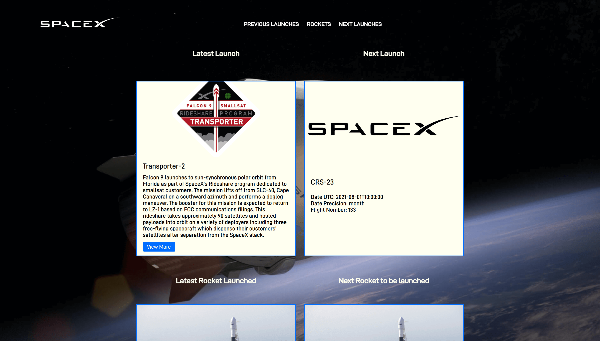

SpaceX Launches
Single Page Application that displays some information from the SpaceX API, such as previous and next launches, and all rockets.

The main purpose of the project was to learn React and Webpack, so I created it from scratch by configuring Webpack manually.
``` 
cd spacex-launches
git clone https://github.com/deztidev/spacex-launches.git 
npm install
npm run build
npm run start
```
